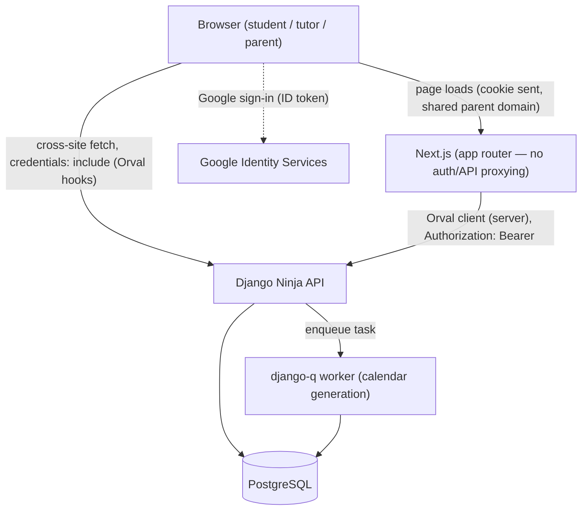

# Architecture Overview

This is the technical architecture for school-ahead, translating the domain documentation under `/docs/core` and `/docs/interfaces` into a concrete Django + Next.js design. It covers backend app boundaries, the data model, the lesson lifecycle, the API contract, the JWT/Google auth flow, the frontend structure, and the calendar-generation feature — application/data/API/frontend design only; docker-compose, Dockerfiles, and CI/CD are explicitly out of scope for this pass.

## System context

Django Ninja is the only service that talks to Postgres. There is no BFF/proxy layer — but the Orval-generated client is called from **both** sides of Next.js: from the browser (React Query hooks, cookie-authenticated) and from Next.js's own server (Server Components / Route Handlers / Server Actions, Bearer-authenticated), reusing the **same** JWT the browser already holds rather than issuing a separate one. See `05-auth-flow.md` for exactly how a single cookie authenticates both call paths. Long-running work (calendar generation) runs in a `django-q` worker, not inline in the request/response cycle (see `08-calendar-generation.md`).

## Stack summary

| Layer | Technology |
|---|---|
| Frontend framework | Next.js (App Router), Bun |
| Frontend UI | Tailwind, Radix UI, shadcn/ui |
| Frontend state | Zustand (ephemeral client state only) |
| Frontend data fetching | React Query + Orval-generated client |
| Frontend forms | React Hook Form + Zod |
| Frontend i18n | next-intl (`uk` default) |
| Frontend testing | Vitest |
| Backend framework | Django + Django Ninja |
| Backend database | PostgreSQL |
| Backend background jobs | django-q |
| Backend testing | pytest |
| Backend tooling | uv, ruff, ty |
| Auth | Google social auth, JWT (Django-issued httpOnly cross-site cookies, no BFF) |

## Cross-cutting principles

1. **Domain-driven Django apps.** One app per bounded domain (`accounts`, `academics`, `lessons`, `tutoring`, `progress`, `scheduling`), not one app per user role and not a single monolithic app. See `01-backend-apps.md`.
2. **Frontend calls Django directly — no BFF, but the Orval client runs on both sides of Next.js.** Client Components use the Orval-generated React Query hooks straight from the browser (cross-origin, `credentials: 'include'`). Server Components, Route Handlers, and Server Actions call the *same* generated client with a server-side mutator that reads the JWT out of the incoming request's cookie (`next/headers`) and sends it as `Authorization: Bearer`. Both paths authenticate as the same user with the same token — Django never issues Next.js a separate credential. Tokens still never reach client-side JavaScript. See `05-auth-flow.md`.
3. **Curriculum vs. per-student progress is a hard split.** `Lesson` (template) and `StudentLesson` (per-student instance) are different tables, confirmed directly by `docs/core/lessons.md`'s "Core Domain Components" section. See `02-data-model.md`.
4. **Single writer per table.** Every write to `StudentLesson` — status transitions, grading, and scheduling — goes through `lessons`'s service layer, even when the triggering endpoint lives in another app (e.g. `scheduling` or `tutoring`). See `01-backend-apps.md` and `02-data-model.md`.
5. **Tutor-scope filtering is enforced at the queryset level**, never only by hiding response fields. See `04-api-design.md`.
6. **Documentation gaps are stated explicitly, not silently resolved.** Where `/docs` is silent or self-contradictory, this architecture states its assumption in `07-open-questions.md` rather than presenting a guess as a confirmed rule.

## Contents

- [01 — Backend Apps](01-backend-apps.md)
- [02 — Data Model](02-data-model.md)
- [03 — Lesson Lifecycle](03-lesson-lifecycle.md)
- [04 — API Design](04-api-design.md)
- [05 — Auth Flow](05-auth-flow.md)
- [06 — Frontend Architecture](06-frontend-architecture.md)
- [07 — Open Questions](07-open-questions.md)
- [08 — Calendar Generation](08-calendar-generation.md)
