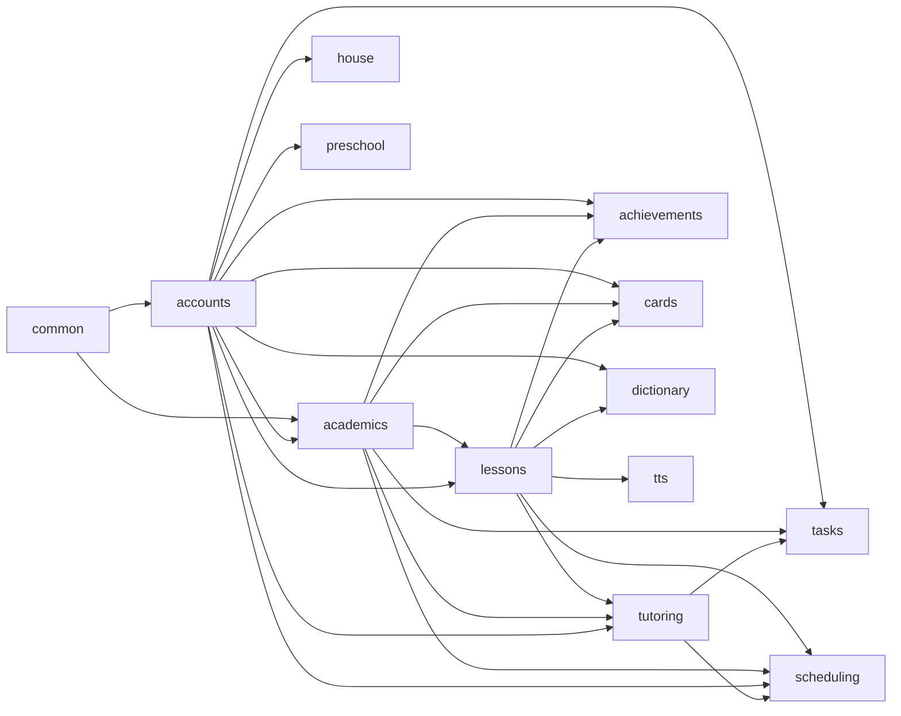

# Backend Apps

The Django backend (`backend/core/`, the project itself — settings, urls, asgi/wsgi — is not a domain app; see the `core` note below) is split into 13 domain apps plus `common`, one shared infrastructure app. Boundaries follow the bounded-domain principle stated in `00-overview.md` — one app per area of the business, not one per user role and not a single monolith.

Seven of these apps (`house`, `preschool`, `tasks`, `cards`, `dictionary`, `tts`, and `achievements`) were added after the original 7-app design (`accounts`/`academics`/`lessons`/`tutoring`/`scheduling`/`common` plus a never-built `progress`) and post-date `02-data-model.md`'s original ERDs — see the entity ownership table and `02-data-model.md`'s "Gamification & extensions" ERD for what they actually own.

## App list

### `core` (project root, not a domain app)
Not a bounded domain — this is the Django *project* (`backend/core/`): `settings.py` (`INSTALLED_APPS`, middleware, storage backend), `urls.py` (wires the single Ninja `NinjaAPI` instance and registers every app's router under its prefix — `/api/auth`, `/api/academics`, `/api/student-lessons`, `/api/tasks`, `/api/tutor`, `/api/schedule`, `/api/achievements`, `/api/tts`, `/api/dictionary`, `/api/house`, `/api/cards`, `/api/preschool`, plus `/api/mcp` and Django admin), and `asgi.py`/`wsgi.py`. Listed here only so it isn't mistaken for a missing domain app; see `04-api-design.md` for the full router breakdown.

### `common`
Cross-cutting infrastructure only — not a bounded domain in its own right. Owns the abstract `TimeStampedModel`, shared enums, the shared Ninja `CookieOrBearerJWTAuth` auth class (accepts either the browser's httpOnly cookie or Next.js server's `Authorization: Bearer` header — see `05-auth-flow.md`) and its CSRF double-submit validation (cookie-authenticated requests only), pagination configuration, and permission mixins (`IsTutorForSubject`, `IsOwnerStudent`). Has no models of its own and exposes no router. CORS configuration (`django-cors-headers`) is project-level settings, not app code, but is documented here as part of the same cross-cutting concern.

`common.images` gives the icons of `SubjectGroup`, `Subject` and `Lesson` a scaled-down copy (`icon_thumbnail`, a `django-imagekit` spec: 176px for a group, 320px for a subject or lesson, proportions and format kept, never scaled up). imagekit makes the file the first time its URL is read, so there is no backfill and no migration. `common.images.icon_url` is what every serializer calls in place of the icon's own URL — the API field is still `icon`, it just points at the thumbnail — and it falls back to the original when a thumbnail can't be made (an SVG, a file that isn't really an image, one missing from storage). Replacing a subject's icon (`tutoring.api.upload_tutor_subject_icon`) deletes the old thumbnail along with the old icon.

### `accounts`
Identity, roles, and auth data. Owns the custom `AUTH_USER_MODEL` (a single `User` table with a `role` field — student/tutor/parent/admin — rather than three unrelated user types), the one-to-one profile extension tables per role, the Parent↔Student relationship, Google social-account linkage, and refresh-token storage used for JWT rotation and revocation.

### `academics`
Curriculum structure only, with no per-student state: `School → Class → Subject → SubjectBlock → Topic`, including `Subject.start_date`/`due_date` and `Topic.order_index` (tutor-editable, exposed via its own `PATCH` endpoints). `academics.services.assign_topics_to_blocks` owns `Topic.subject_block` — auto-assigned (even split across the subject's blocks, in `order_index` order), not hand-edited — which every `Lesson` under that Topic inherits (see `02-data-model.md`, decision 4). Calendar generation/recalculation triggers do **not** live here — they live in `scheduling` (see below) — `academics` only owns the structural data those triggers read.

### `lessons`
The full Lesson bounded context: template content (`Lesson`, `LessonAttachment`, `QuizQuestion`, `QuizChoice`) **and** per-student instances (`StudentLesson`, `LessonSubmission`, `StudentLessonStatusEvent`). `lessons` is the sole writer of the `StudentLesson` table — every write to it, including `scheduled_date` and `is_manually_scheduled`, goes through this app's service layer (`lessons.services`), whether the caller is the student wizard, tutor grading, or `scheduling`'s calendar generation/reschedule flows.

### `tutoring`
Tutor↔Subject assignment (`TutorSubjectAssignment`) and the tutor dashboard routers built on top of it. Drives all tutor-scope filtering. Delegates actual mutations (grading, resolving a Need-Help flag) to `lessons`'s service layer rather than writing `StudentLesson` itself.

Also owns **default admin-tutor and class-teacher auto-provisioning**: every `role == admin` user is assigned as tutor of every subject, by default, and a subject's `Class.class_teacher` (if set) is auto-assigned as a tutor of every subject under that class. Three triggers, all implemented as `tutoring.services` calls fired from `post_save`/`pre_save` signals (`tutoring/signals.py`, see `02-data-model.md`, decision 7):
- On `Subject` creation (`academics` → `tutoring`): assign every current admin to the new subject (`assign_admins_to_subject`), and the class's `class_teacher` if set (`assign_class_teacher_to_subject`).
- On a `User` being granted `role == admin` (`accounts` → `tutoring`): assign that admin to every existing subject (`assign_admin_to_all_subjects`).

All three use `get_or_create(tutor=..., subject=...)`, never touching `is_active` on a row that already exists — so an admin/class-teacher who was manually unassigned (`is_active = False`) stays unassigned; the trigger only fills gaps, it never reactivates.

This requires `accounts → tutoring` as an additional allowed import direction (see the dependency diagram below).

### `achievements`
Not the ledger/badges design `02-data-model.md` originally specced under a `progress` app — that app was never built, and diamonds are a plain cache counter on `accounts.StudentProfile.diamond_balance_cache` (see `docs/core/progress.md` §2, `docs/core/gamification.md`). `achievements` owns exactly one small, unrelated concern: `ProgressBadge`, a tier of gamified badges keyed off a *subject's* overall lesson-completion percent, surfaced on the Subject detail page and the "Мої досягнення" overview. One read endpoint, `GET /api/achievements/subjects`, computed via `lessons.services.compute_completion`.

### `house`
The 3D room/furniture-shop gamification feature — a separate shop domain from the avatar wardrobe (`accounts.AvatarItem`), sharing only the Diamond currency. Owns the furniture catalog (`FurnitureItem` — 3D asset + optional `.mtl` + textures, price, default transform, which room surface it snaps to), per-student ownership (`FurniturePurchase`) and current room placement (`PlacedFurnitureItem`, one row per owned-and-placed item, free 3D position/rotation/scale via a `TransformControls` gizmo on the frontend), and a student's wall/floor color choice (`RoomStyle`, created lazily on first read/write). Rendered by the frontend's `@school-ahead/house-3d` package (three.js via `@react-three/fiber`).

### `preschool`
Tutor-authored content management for the "Казки" (Stories) reading minigame — distinct from the static, filesystem-driven stories under the frontend's `public/static/stories/`. Owns `Story` (title/slug/cover/Markdown `content` using the same `{...}` syllable/image/audio/video card syntax the static stories use, so the game's existing parser needs no changes to read a DB-backed story) and `StoryAsset` (uploaded media embedded via the story editor). `is_published` gates the public/game-facing endpoints; a tutor's own `/api/preschool/tutor/stories*` endpoints always see every story, published or not.

### `tasks`
Optional, ungraded practice work attached to a `Topic` — unrelated to `Lesson.lesson_type == with_task` (that's a *Lesson's* submission step; a different concept entirely). Owns `Task` (tutor-authored, markdown or image content, no per-student assignment — every student in the subject's class sees every `Task` under its topic immediately), `TaskCompletion` (existence-as-done-signal, freely togglable, no grading), and `TaskSubmission` (an optional free-text/file answer, independent of completion, overwritten in place on resubmission — no review workflow, no history).

### `cards`
A personal flashcard feature ("Картки"), separate from the preschool `cards-game.tsx` minigame of a similar name. Owns `StudentCard` (a word/phrase + translation a student saved, filed into the flashcard app's Group/Set/Category structure via *either* a real `lessons.Lesson` — Subject=group, Topic=set, Lesson=category — *or* an imported `StudentCustomLesson`, enforced by a `CheckConstraint`) plus `StudentCustomTopic`/`StudentCustomLesson` (a personal, non-`academics.Topic` set/category structure for an imported `set.json` deck whose titles don't match real curriculum — deliberately excluded from `order_index`/`subject_block`/scheduling so an import can never leak into a class's real course listing or completion %).

### `dictionary`
A small personal-vocabulary feature: `DictionaryItem` (a 1–5-word saved translation, with the source sentence and its translation kept for context), populated from a "Додати до словника" button while a student is translating lesson content. No FK to the source material — an entry survives the material being edited or deleted.

### `tts`
Minor, config-only: `TtsVoiceSetting` maps a (language, voice profile) pair to a Piper TTS voice id, read via one endpoint (`GET /api/tts/voices`) that the frontend's client-side Piper TTS falls back from to its own hardcoded defaults when a row is missing.

### `scheduling`
The full schedule/calendar bounded context — **not read-only**. Read side: Weekly Calendar / Today / Backlog, computed by querying `lessons.StudentLesson`. Write side: triggering calendar generation, forced recalculation, and manual single-lesson reschedule, per `docs/core/schedule_planning.md`. Owns zero models of its own — its routers validate against `academics.Subject`/`Topic` (dates, topic order) and call directly into `lessons.services`, synchronously and inline in the request (not via a `django-q` task — that dependency isn't installed anywhere in this codebase), to create/update `StudentLesson` rows, so `lessons` remains the sole writer of the table itself even though `scheduling` owns the write-facing endpoints and orchestration. See `08-calendar-generation.md` for the full algorithm.

## Entity ownership

| App | Models owned |
|---|---|
| `common` | none (abstract base only) |
| `accounts` | `User`, `StudentProfile`, `TutorProfile`, `ParentProfile`, `ParentStudentLink`, `SocialAccount`, `RefreshToken` |
| `academics` | `School`, `Class`, `Subject`, `SubjectBlock`, `Topic` |
| `lessons` | `Lesson`, `LessonAttachment`, `QuizQuestion`, `QuizChoice`, `StudentLesson`, `LessonSubmission`, `StudentLessonStatusEvent` |
| `tutoring` | `TutorSubjectAssignment` |
| `achievements` | `ProgressBadge` |
| `house` | `FurnitureItem`, `FurnitureTexture`, `FurniturePurchase`, `PlacedFurnitureItem`, `RoomStyle` |
| `preschool` | `Story`, `StoryAsset` |
| `tasks` | `Task`, `TaskCompletion`, `TaskSubmission` |
| `cards` | `StudentCard`, `StudentCustomTopic`, `StudentCustomLesson` |
| `dictionary` | `DictionaryItem` |
| `tts` | `TtsVoiceSetting` |
| `scheduling` | none — pure orchestration over `academics` and `lessons` |

## Resolved ambiguities

- **Student/Tutor/Parent profiles hang off one custom `User`** (single login table + `role` field), not three unrelated user types — simplifies auth and keeps a single `USERNAME_FIELD`.
- **The Tutor↔Subject junction lives in `tutoring`**, not `academics` — it's access-control/relationship data from the tutor's perspective, and `tutoring`'s whole purpose is that relationship plus the dashboards built on it.
- **Diamonds are not ledgered.** The original design called for a decoupled `progress` app owning an append-only diamond ledger plus achievements — that app was never built. Lesson-completion diamonds are awarded directly inside `lessons.services.mark_completed` against `accounts.StudentProfile.diamond_balance_cache`, a plain running counter with no audit trail (see `docs/core/progress.md` §2, `docs/core/gamification.md`). `achievements` (badges keyed off subject completion %) is a separate, later app that happens to share the name's gamification theme but implements none of the originally-planned ledger design.
- **Calendar generation/recalculation/reschedule endpoints live in `scheduling`**, not `academics` or `lessons` — they're schedule-mutating operations and belong with the rest of the calendar bounded context, even though the underlying `StudentLesson` row writes still go through `lessons.services`.
- **Admins hold a `TutorProfile` in addition to their `admin` role**, auto-provisioned by `tutoring`, so "assigned as tutor to every subject" is a real `TutorSubjectAssignment` row like any other tutor's, rather than a special-cased permission bypass — `tutoring`'s existing tutor-scope-filtering code path (`get_tutor_subject_ids`) needs no admin-specific branch.

## App dependency diagram

Arrows point from a dependency to the app that depends on it — the app at the arrowhead may import from the app at the tail. Verified directly against `from <app>.` imports in each app's `models.py`/`services.py`/`api.py` (excluding migrations/tests), not just inferred from the design. Direct `common -->` edges are omitted below wherever they're already implied transitively through `accounts`/`academics`/`lessons` (every app imports `common` directly too, but that edge would otherwise clutter every node).

No app imports "backwards" against these arrows — e.g. `lessons` never imports from `tutoring`, `scheduling`, or any of `achievements`/`house`/`preschool`/`tasks`/`cards`/`dictionary`/`tts`. None of those seven newer apps are imported by any other app either — they're all leaves. `tutoring --> scheduling` (via `scheduling/api.py` calling `tutoring.services` for tutor-scope checks) was missing from the original diagram; added here.

---
[← Back to Overview](00-overview.md)
