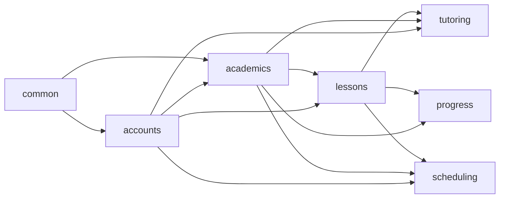

# Backend Apps

The Django backend is split into seven apps: six domain apps plus one shared infrastructure app. Boundaries follow the bounded-domain principle stated in `00-overview.md` — one app per area of the business, not one per user role and not a single monolith.

## App list

### `common`
Cross-cutting infrastructure only — not a bounded domain in its own right. Owns the abstract `TimeStampedModel`, shared enums, the shared Ninja `CookieOrBearerJWTAuth` auth class (accepts either the browser's httpOnly cookie or Next.js server's `Authorization: Bearer` header — see `05-auth-flow.md`) and its CSRF double-submit validation (cookie-authenticated requests only), pagination configuration, and permission mixins (`IsTutorForSubject`, `IsOwnerStudent`). Has no models of its own and exposes no router. CORS configuration (`django-cors-headers`) is project-level settings, not app code, but is documented here as part of the same cross-cutting concern.

### `accounts`
Identity, roles, and auth data. Owns the custom `AUTH_USER_MODEL` (a single `User` table with a `role` field — student/tutor/parent/admin — rather than three unrelated user types), the one-to-one profile extension tables per role, the Parent↔Student relationship, Google social-account linkage, and refresh-token storage used for JWT rotation and revocation.

### `academics`
Curriculum structure only, with no per-student state: `School → Class → Subject → SubjectBlock → Topic`, including `Subject.start_date`/`due_date` and `Topic.order_index` (tutor-editable, exposed via its own `PATCH` endpoints). `academics.services.assign_topics_to_blocks` owns `Topic.subject_block` — auto-assigned (even split across the subject's blocks, in `order_index` order), not hand-edited — which every `Lesson` under that Topic inherits (see `02-data-model.md`, decision 4). Calendar generation/recalculation triggers do **not** live here — they live in `scheduling` (see below) — `academics` only owns the structural data those triggers read.

### `lessons`
The full Lesson bounded context: template content (`Lesson`, `LessonAttachment`, `QuizQuestion`, `QuizChoice`) **and** per-student instances (`StudentLesson`, `LessonSubmission`, `StudentLessonStatusEvent`). `lessons` is the sole writer of the `StudentLesson` table — every write to it, including `scheduled_date` and `is_manually_scheduled`, goes through this app's service layer (`lessons.services`), whether the caller is the student wizard, tutor grading, or `scheduling`'s calendar generation/reschedule flows.

### `tutoring`
Tutor↔Subject assignment (`TutorSubjectAssignment`) and the tutor dashboard routers built on top of it. Drives all tutor-scope filtering. Delegates actual mutations (grading, resolving a Need-Help flag) to `lessons`'s service layer rather than writing `StudentLesson` itself.

Also owns **default admin-tutor auto-provisioning**: every `role == admin` user is assigned as tutor of every subject, by default. Two triggers, both implemented as `tutoring.services` calls fired from `post_save` signals (see `02-data-model.md`, decision 7):
- On `Subject` creation (`academics` → `tutoring`): assign every current admin to the new subject.
- On a `User` being granted `role == admin` (`accounts` → `tutoring`): assign that admin to every existing subject.

This requires `accounts → tutoring` as an additional allowed import direction (see the dependency diagram below).

### `progress`
Gamification: the diamond ledger (`DiamondLedgerEntry`), achievements/badges (`Achievement`, `StudentAchievement`), and the Subject Progress screen's aggregation queries (completion %, average grade, per-block breakdown, diamond balance).

### `scheduling`
The full schedule/calendar bounded context — **not read-only**. Read side: Weekly Calendar / Today / Backlog, computed by querying `lessons.StudentLesson`. Write side: triggering calendar generation, forced recalculation, and manual single-lesson reschedule, per `docs/core/schedule_planning.md`. Owns zero models of its own — its routers validate against `academics.Subject`/`Topic` (dates, topic order) and enqueue a `django-q` task that calls into `lessons.services` to create/update `StudentLesson` rows, so `lessons` remains the sole writer of the table itself even though `scheduling` owns the write-facing endpoints and orchestration. See `08-calendar-generation.md` for the full algorithm.

## Entity ownership

| App | Models owned |
|---|---|
| `common` | none (abstract base only) |
| `accounts` | `User`, `StudentProfile`, `TutorProfile`, `ParentProfile`, `ParentStudentLink`, `SocialAccount`, `RefreshToken` |
| `academics` | `School`, `Class`, `Subject`, `SubjectBlock`, `Topic` |
| `lessons` | `Lesson`, `LessonAttachment`, `QuizQuestion`, `QuizChoice`, `StudentLesson`, `LessonSubmission`, `StudentLessonStatusEvent` |
| `tutoring` | `TutorSubjectAssignment` |
| `progress` | `DiamondLedgerEntry`, `Achievement`, `StudentAchievement` |
| `scheduling` | none — pure orchestration over `academics` and `lessons` |

## Resolved ambiguities

- **Student/Tutor/Parent profiles hang off one custom `User`** (single login table + `role` field), not three unrelated user types — simplifies auth and keeps a single `USERNAME_FIELD`.
- **The Tutor↔Subject junction lives in `tutoring`**, not `academics` — it's access-control/relationship data from the tutor's perspective, and `tutoring`'s whole purpose is that relationship plus the dashboards built on it.
- **Diamonds/achievements live in `progress`**, decoupled from the lesson state machine — lesson completion triggers a service call into `progress`, never the reverse.
- **Calendar generation/recalculation/reschedule endpoints live in `scheduling`**, not `academics` or `lessons` — they're schedule-mutating operations and belong with the rest of the calendar bounded context, even though the underlying `StudentLesson` row writes still go through `lessons.services`.
- **Admins hold a `TutorProfile` in addition to their `admin` role**, auto-provisioned by `tutoring`, so "assigned as tutor to every subject" is a real `TutorSubjectAssignment` row like any other tutor's, rather than a special-cased permission bypass — `tutoring`'s existing tutor-scope-filtering code path (`get_tutor_subject_ids`) needs no admin-specific branch.

## App dependency diagram

Arrows show allowed import direction (the app at the tail may import from the app at the head).

No app imports "backwards" against these arrows — e.g. `lessons` never imports from `tutoring`, `progress`, or `scheduling`.

---
[← Back to Overview](00-overview.md)
