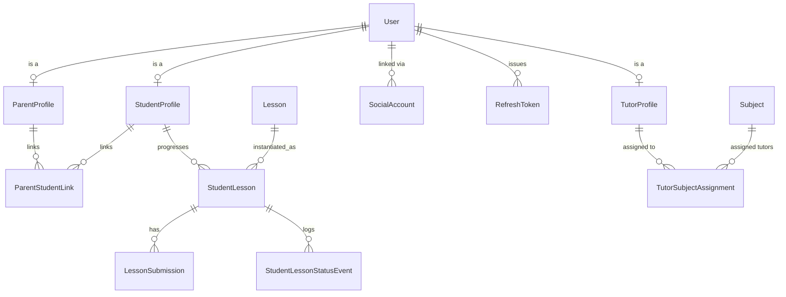
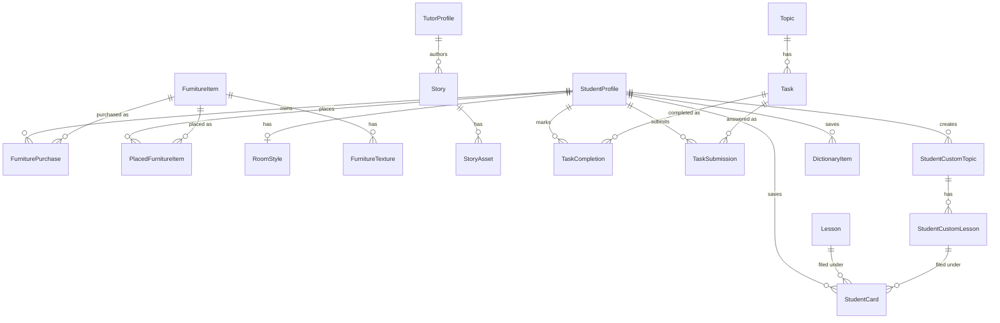

# Data Model

Full entity-relationship design for school-ahead, grounded in `docs/core/data.md`, `docs/core/lessons.md`, `docs/core/progress.md`, and `docs/core/schedule_planning.md`. Field tables below are the source of truth for migrations; the ERDs below are a visual index, not exhaustive of every field.

## Key design decisions

These go beyond — or in one case, are now directly confirmed by — what `/docs` states literally, so they're called out explicitly here rather than left implicit in the schema.

1. **`Lesson` (template) vs `StudentLesson` (per-student instance) split.** This is no longer just an inferred design choice: the updated `docs/core/lessons.md` has a "Core Domain Components" section naming both entities verbatim — "Template Content (`Lesson`): Stores static lesson data, multi-page materials, wizard configurations, and quiz questions" and "Per-Student Instances (`StudentLesson`): Manages the dynamic execution state for individual students." Rationale: curriculum content (Markdown, wizard steps, materials) is shared under `Topic`; status/scheduled_date/completed_at/grade are inherently per-student (ahead-mode means independent per-student progress). A single `Lesson` row with a student FK would duplicate curriculum content per enrollment and block retroactive curriculum edits.

2. **Backlog is computed at query time, never persisted.** Backlog = `StudentLesson.objects.filter(student=X, status != completed, scheduled_date < today)`. The "Mon #4" origin label (per `docs/interfaces/student/calendar.md` and `today.md`) is derived at read time from the weekday + ordinal position among that day's lessons, using whatever `scheduled_date` currently holds — this is no longer a fixed original date, since `docs/core/schedule_planning.md` allows it to move (see decision 5). Avoids a persisted-record/source-of-truth drift risk.

3. **Diamonds were originally designed as an append-only ledger (`DiamondLedgerEntry`), not a running counter** — for an audit trail, negative correction entries (e.g. a tutor downgrades a grade post-award), and per-subject/per-block balances derivable via `SUM(...)`. **This was never built.** There is no ledger table and no `progress` app anywhere in the codebase; `StudentProfile.diamond_balance_cache` is a plain running integer, incremented directly by every diamond-awarding code path with no per-award record beyond two idempotency-guard tables (`TopicCompletionBonus`, `SemesterCompletionBonus`). None of the audit-trail/correction/per-subject-breakdown properties this decision describes actually exist. See `docs/core/progress.md` §2 and `docs/core/gamification.md` for what's actually built, and `01-backend-apps.md`'s `achievements` section for the (unrelated) app that exists instead.

4. **`Topic.subject_block` is the source of truth for block membership, not a per-`StudentLesson` field.** A Topic belongs to exactly one `SubjectBlock` (even split across the subject's blocks, in `order_index` order — same rule as `SubjectBlock` count itself), and every `Lesson` under it — and so every student's `StudentLesson` for that lesson — inherits that block. `academics.services.assign_topics_to_blocks` recomputes the assignment from scratch (no override concept) whenever topics or blocks change: topic create/update/delete/reorder, or `block_count` changing via `ensure_subject_blocks`. This superseded an earlier design where `StudentLesson` carried its own immutable `subject_block` FK, assigned per-lesson during calendar generation — moving it onto `Topic` keeps it structural (owned by `academics`, no per-student state) and guarantees every lesson in a topic reports the same block consistently.

5. **`StudentLesson.scheduled_date` is mutable, not immutable.** It's set by calendar generation, can be overwritten by forced recalculation, and can be moved for a single lesson via manual tutor reschedule (`docs/core/schedule_planning.md`). To keep recalculation from silently clobbering a tutor's deliberate manual move — or a student's completed history — `StudentLesson` carries `is_manually_scheduled` (boolean, default `False`, set `True` by the manual-reschedule endpoint), and the recalculation algorithm skips any `StudentLesson` that is `status == completed` or has `is_manually_scheduled == True`. This is a design decision beyond what the doc states literally — see `08-calendar-generation.md` — and the doc's own ambiguity (does forced recalculation intend to override manual moves too?) is listed in `07-open-questions.md`.

6. **Calendar generation was originally designed to run as a background `django-q` task, but runs synchronously instead.** `scheduling.api.generate_calendar`/`recalculate_calendar` call `scheduling.services.generate_calendar_for_subject` directly, inline in the request/response cycle — see `08-calendar-generation.md`. `django-q` is not installed in this codebase (no `django_q` reference anywhere in `backend/`, not in `INSTALLED_APPS`) despite being listed as a planned dependency elsewhere.

7. **Admins are auto-provisioned a `TutorProfile` and assigned as tutor to every `Subject`, by default — and a `Class.class_teacher` is auto-assigned tutor of every `Subject` under their class.** A `role == admin` `User` is not naturally a tutor, but `TutorSubjectAssignment.tutor` FKs to `TutorProfile` — so rather than special-casing admin in every tutor-scope query, `tutoring.services` (see `01-backend-apps.md`) auto-creates a `TutorProfile` for each admin and a `TutorSubjectAssignment` row linking it to every `Subject`, keeping `get_tutor_subject_ids` a single code path for tutors and admins alike; the same `get_or_create` pattern auto-assigns a class's homeroom teacher to every subject under that class. Three `post_save`/`pre_save` triggers keep this in sync (`tutoring/signals.py`): a new `Subject` gets every existing admin **and** its class's teacher assigned; a `User` newly granted `role == admin` gets assigned to every existing `Subject`. **Revocation is resolved**, not open: every trigger uses `get_or_create(tutor=..., subject=...)`, which only fills a missing row and never touches `is_active` on one that already exists — so setting `TutorSubjectAssignment.is_active = False` sticks and is never silently reactivated.

## ERD 1 — Curriculum & Organization

```mermaid
erDiagram
    School ||--o{ Class : has
    Class ||--o{ Subject : has
    Subject ||--o{ SubjectBlock : "divided into"
    Subject ||--o{ Topic : has
    SubjectBlock ||--o{ Topic : "assigned topics in"
    Topic ||--o{ Lesson : has
    Lesson ||--o{ LessonAttachment : has
    Lesson ||--o{ QuizQuestion : has
    QuizQuestion ||--o{ QuizChoice : has
    Class ||--o{ StudentProfile : enrolls
```

## ERD 2 — People & Progress



`diamond_balance_cache` lives directly on `StudentProfile` (a plain counter, not a ledger — see decision 3), so there's no separate diamond entity to diagram. `ProgressBadge` (`achievements`) has no FK to `StudentProfile` at all — it's computed on the fly from a subject's completion %, not earned/stored per student. See ERD 3 below for the gamification-extension apps' actual entities.

## ERD 3 — Gamification & extension apps

The seven apps added after the original design (`achievements`, `house`, `preschool`, `tasks`, `cards`, `dictionary`, `tts` — see `01-backend-apps.md`) each own a small, mostly self-contained set of entities:



(`ProgressBadge` and `TtsVoiceSetting` have no FKs to any of the above — both are standalone lookup/config tables — so they're omitted from the diagram; see their field summaries below.)

## Field-level model definitions

### `accounts.User` (custom `AUTH_USER_MODEL`, `USERNAME_FIELD = "email"`)

| Field | Type | Notes |
|---|---|---|
| id | BigAutoField | PK |
| email | EmailField, unique | login identifier |
| first_name / last_name | CharField(150) | |
| role | CharField, choices: student/tutor/parent/admin | domain role, distinct from `is_staff` |
| locale | CharField, default `"uk"` | |
| avatar_url | URLField, null | from Google profile |
| is_active / is_staff / is_superuser | Boolean | Django defaults |
| date_joined / last_login | DateTime | |

### `accounts.StudentProfile`
`user` (O2O) · `school_class` (FK → `academics.Class`) · `enrolled_at` (Date) · `diamond_balance_cache` (PositiveInteger, default 0 — perf cache only, see decision 3).

### `accounts.TutorProfile`
`user` (O2O) · `bio` (TextField, markdown, blank) · `is_active` (Boolean, default True). Held by `role == tutor` users, and auto-provisioned for `role == admin` users too (decision 7) so admins can carry `TutorSubjectAssignment` rows like any other tutor.

### `accounts.ParentProfile`
`user` (O2O).

### `accounts.ParentStudentLink`
`parent` (FK) · `student` (FK) · `relationship` (choices: mother/father/guardian/other) · `is_primary_contact` (Boolean). `unique_together(parent, student)`.

### `accounts.SocialAccount`
`user` (FK) · `provider` (choices: google, default google) · `provider_uid` (unique — Google `sub`) · `raw_data` (JSONField) · `created_at`.

### `accounts.RefreshToken`
`id` (UUID PK, used as `jti`) · `user` (FK) · `issued_at` · `expires_at` · `revoked_at` (null) · `user_agent` / `ip_address` (optional) · `replaced_by` (FK-self, null — rotation chain).

### `academics.School`
`name` · `locale_default` (default `"uk"`) · `timezone` (default `"Europe/Kyiv"`) · `created_at`.

### `academics.Class`
`school` (FK) · `name` (CharField(50), free-text — `Pre1`, `Pre2`, `1`, `2`, ...) · `order_index` (PositiveSmallInt — explicit sort key, since `name` isn't numerically sortable) · `academic_year` (CharField(9), e.g. `"2025/2026"`) · `created_at`. `unique_together(school, name, academic_year)`.

### `academics.Subject`
`school_class` (FK) · `name` · `description` (TextField, markdown) · `recommended_resources` (TextField, markdown, blank) · `block_count` (PositiveSmallInt, default 2) · `start_date` (Date, default September 1 of the class's academic year) · `due_date` (Date, default `start_date` + 9 months) · `created_at` / `updated_at`. Model-level `clean()` / service-level validation enforces `start_date < due_date` (the schedule-planning doc's "core guardrail") on every save, including manual admin edits.

### `academics.SubjectBlock`
`subject` (FK) · `index` (PositiveSmallInt, 1-based) · `label` (CharField(100), blank — auto `"Semester {index}"` or custom) · `status` (choices: active/closed, default active) · `starts_on` / `ends_on` (Date, null) · `closed_at` (DateTime, null). `unique_together(subject, index)`. The even-split-with-remainder-to-first-block logic (per `docs/core/data.md`) lives in a domain service, not the model.

### `academics.Topic`
`subject` (FK) · `title` · `description` (TextField, markdown, blank) · `order_index` (PositiveSmallInt — tutor-editable via drag-and-drop, drives calendar generation, see `08-calendar-generation.md`) · `subject_block` (FK → `SubjectBlock`, null — auto-assigned by `assign_topics_to_blocks`, not hand-edited, see decision 4) · `created_at`.

### `lessons.Lesson` (template)
`topic` (FK) · `order_index` (PositiveSmallInt) · `title` · `lesson_type` (choices: `with_quiz`/`theory`/`with_task` — see `03-lesson-lifecycle.md` for what each drives) · `grading_type` (choices: points/binary) · `content` (TextField, markdown) · `default_day_offset` (PositiveSmallInt, null — optional default scheduling hint) · `created_at` / `updated_at`. `unique_together(topic, order_index)`.

### `lessons.LessonAttachment`
`lesson` (FK) · `file` / `url` · `kind` (choices: file/video/link) · `title` · `order_index`.

### `lessons.QuizQuestion` / `lessons.QuizChoice`
Minimal MVP quiz modeling (see `07-open-questions.md` for depth caveats). `QuizQuestion`: `lesson` (FK) · `prompt` (TextField, markdown) · `order_index`. `QuizChoice`: `question` (FK) · `text` (TextField, markdown) · `image` (FileField, blank — shown instead of `text` when set) · `is_correct` (Boolean).

### `lessons.StudentLesson` (the core per-student entity)

| Field | Type | Notes |
|---|---|---|
| student | FK → `accounts.StudentProfile` | related_name `student_lessons` |
| lesson | FK → `lessons.Lesson` | related_name `student_lessons`; block membership is read via `lesson.topic.subject_block`, not stored here (decision 4) |
| status | choices: assigned/in_progress/need_help/pending_review/revision_required/completed, default assigned | indexed |
| scheduled_date | DateField | indexed; mutable via generation/recalculation/manual reschedule, but never once `status == completed` (decision 5) |
| is_manually_scheduled | Boolean, default False | set True by the manual-reschedule endpoint; checked by recalculation to avoid overwriting a deliberate tutor move |
| started_at | DateTime, null | set on Assigned → InProgress |
| completed_at | DateTime, null | used for ahead-detection: `completed_at.date() < scheduled_date` |
| grade_points | PositiveSmallInt, null | 1–12, validated |
| grade_result | choices: pass/fail, null | binary grading |
| quiz_score_percent | Decimal, null | `with_quiz` lessons only |
| attempt_count | PositiveSmallInt, default 0 | quiz retakes |
| help_note | TextField, blank | student's note on a help request |
| tutor_feedback | TextField, blank | tutor's note on Need-Help resolution or Pending-Review decision |
| created_at / updated_at | DateTime | |

`unique_together(student, lesson)`.

### `lessons.LessonSubmission`
`student_lesson` (FK, related_name `submissions`) · `file` · `comment` (TextField, blank — student's note per submission/resubmission) · `submitted_at` (auto_now_add) · `is_latest` (Boolean, service-maintained). Append-only — one row per initial submission and each Revision-Required resubmission.

### `lessons.StudentLessonStatusEvent` (audit log — powers the tutor Need-Help feed)
`student_lesson` (FK, related_name `status_events`) · `from_status` · `to_status` · `actor` (FK → User, null = system transition) · `note` (TextField, blank) · `created_at` (indexed).

### `tutoring.TutorSubjectAssignment`
`tutor` (FK → `accounts.TutorProfile`, related_name `assignments`) · `subject` (FK → `academics.Subject`, related_name `tutor_assignments`) · `assigned_at` (auto_now_add) · `is_active` (Boolean, default True). `unique_together(tutor, subject)`.

### `achievements.ProgressBadge`
`name` · `icon` (CharField(8), a single emoji, blank) · `level` (PositiveSmallInt, unique) · `min_percent` / `max_percent` (PositiveSmallInt — tier boundaries against a subject's overall lesson-completion %). No FK to `StudentProfile` — badges are computed per-request from live completion %, not earned/persisted.

### `house.FurnitureItem`
`key` (SlugField, unique) · `name` · `model_file` (FileField, `.obj`/`.stl` only) · `material_file` (FileField, `.mtl`, blank — the `.obj`'s optional sidecar material) · `thumbnail_image` (FileField — flat 2D shop-grid icon) · `price` (PositiveInteger, default 0) · `surface` (choices: floor/wall/ceiling — which room surface it snaps to) · `default_position_x/y/z`, `default_rotation_x/y/z`, `default_scale` (Float — transform applied at purchase time, then freely draggable) · `order_index` · `is_active`.

### `house.FurnitureTexture`
`item` (FK, related_name `textures`) · `file` (FileField) · `original_filename` (CharField — a `.mtl`'s `map_Kd`/etc. directives reference textures by their pre-upload filename, which storage always renames; this keeps that original name resolvable).

### `house.FurniturePurchase`
`student_profile` (FK) · `item` (FK, related_name `purchases`) · `purchased_at` (auto_now_add). `unique_together(student_profile, item)`. Free items (`price == 0`) need no row here.

### `house.PlacedFurnitureItem`
`student_profile` (FK) · `item` (FK, related_name `placements`) · `position_x/y/z`, `rotation_x/y/z` (Float) · `scale` (Float, default 1.0). `unique_together(student_profile, item)` — row existence means "currently placed"; deleted on "put away".

### `house.RoomStyle`
`student_profile` (O2O, related_name `room_style`) · `wall_color` / `floor_color` (CharField(7), `#rrggbb`). Created lazily on first read/write, not backfilled — defaults double as "never touched it".

### `preschool.Story`
`title` · `subtitle` (blank) · `cover_image` (FileField, blank) · `content` (TextField, blank — same `{...}` card-group Markdown syntax the frontend's static `story.md` files use) · `is_published` (Boolean, default False — gates the public/game-facing endpoints only, not the tutor editing surface) · `created_by` (FK → `accounts.TutorProfile`, `SET_NULL`, null) · `slug` (SlugField, unique — Cyrillic-transliterated from `title` once at creation, never auto-updated on later title edits, since the public game route is keyed on it).

### `preschool.StoryAsset`
`story` (FK, related_name `assets`) · `file` (FileField, image/audio/video, validated extension list) · `original_filename` (blank, default `''`).

### `tasks.Task`
`topic` (FK → `academics.Topic`, related_name `tasks`) · `title` · `kind` (choices: markdown/image) · `content` (TextField, blank — set iff `kind == markdown`) · `image` (FileField, blank — set iff `kind == image`) · `order_index`. No per-student assignment.

### `tasks.TaskCompletion`
`student` (FK) · `task` (FK, related_name `completions`) · `completed_at` (auto_now_add). `unique_together(student, task)` — existence is the done signal; deleted (not flagged) to un-mark.

### `tasks.TaskSubmission`
`task` (FK, related_name `submissions`) · `student` (FK) · `text` (TextField, blank) · `file` (FileField, blank) · `updated_at` (auto_now). `unique_together(student, task)` — resubmission overwrites in place, no history, no grading.

### `cards.StudentCustomTopic` / `cards.StudentCustomLesson`
Personal, non-`academics.Topic`/`Lesson` set/category structure for an imported flashcard deck whose titles didn't resolve to real curriculum. `StudentCustomTopic`: `student` (FK) · `subject` (FK → `academics.Subject` — still tied to a real subject so the cards show on that subject's Картки tab) · `title`. `unique_together(student, subject, title)`. `StudentCustomLesson`: `topic` (FK, related_name `lessons`) · `title` · `order_index`. `unique_together(topic, title)`.

### `cards.StudentCard`
`student` (FK) · `lesson` (FK → `lessons.Lesson`, null) · `custom_lesson` (FK → `StudentCustomLesson`, null) · `term` · `translation` · `definition` (TextField, blank — example sentence) · `order_index`. `CheckConstraint` enforces exactly one of `lesson`/`custom_lesson` set.

### `dictionary.DictionaryItem`
`student` (FK, related_name `dictionary_items`) · `text` (CharField(255) — 1–5 words, enforced server-side) · `lang` (choices, shared `lessons.MaterialLanguage`) · `translation` · `sample` / `sample_translation` (TextField — the source sentence, for context) · `status` (choices: new/in_progress/known, default new) · `created_at`. No FK to source material — survives it being edited/deleted.

### `tts.TtsVoiceSetting`
`language` (choices, shared `lessons.QuizLanguage`) · `profile` (choices: short/sentence) · `voice_id` (choices, Piper voice catalog). `unique_together(language, profile)`. Standalone config, not tied to any student/lesson row.

## Field/status vocabulary consistency

The status choice names (`assigned`, `in_progress`, `need_help`, `pending_review`, `revision_required`, `completed`) and the `lesson_type` (`with_quiz`/`theory`/`with_task`) and `grading_type` (`points`/`binary`) choices used here match exactly what's used in `03-lesson-lifecycle.md` and `04-api-design.md`.

---
[← Back to Overview](00-overview.md)
