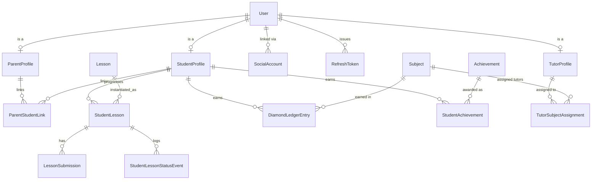

# Data Model

Full entity-relationship design for school-ahead, grounded in `docs/core/data.md`, `docs/core/lessons.md`, `docs/core/progress.md`, and `docs/core/schedule_planning.md`. Field tables below are the source of truth for migrations; the ERDs below are a visual index, not exhaustive of every field.

## Key design decisions

These go beyond — or in one case, are now directly confirmed by — what `/docs` states literally, so they're called out explicitly here rather than left implicit in the schema.

1. **`Lesson` (template) vs `StudentLesson` (per-student instance) split.** This is no longer just an inferred design choice: the updated `docs/core/lessons.md` has a "Core Domain Components" section naming both entities verbatim — "Template Content (`Lesson`): Stores static lesson data, multi-page materials, wizard configurations, and quiz questions" and "Per-Student Instances (`StudentLesson`): Manages the dynamic execution state for individual students." Rationale: curriculum content (Markdown, wizard steps, materials) is shared under `Topic`; status/scheduled_date/completed_at/grade are inherently per-student (ahead-mode means independent per-student progress). A single `Lesson` row with a student FK would duplicate curriculum content per enrollment and block retroactive curriculum edits.

2. **Backlog is computed at query time, never persisted.** Backlog = `StudentLesson.objects.filter(student=X, status != completed, scheduled_date < today)`. The "Mon #4" origin label (per `docs/interfaces/student/calendar.md` and `today.md`) is derived at read time from the weekday + ordinal position among that day's lessons, using whatever `scheduled_date` currently holds — this is no longer a fixed original date, since `docs/core/schedule_planning.md` allows it to move (see decision 5). Avoids a persisted-record/source-of-truth drift risk.

3. **Diamonds are an append-only ledger (`DiamondLedgerEntry`), not a running counter.** Needs an audit trail, needs to support negative correction entries (e.g. a tutor downgrades a grade post-award), and per-subject/per-block balances are derivable via `SUM(...)`. A `StudentProfile.diamond_balance_cache` may exist purely as a perf-optimization cache refreshed by a `django-q` task, but the ledger is the source of truth.

4. **`StudentLesson.subject_block` is immutable once assigned**, even if `Subject.block_count` changes later or lessons are reordered — preserves historical correctness of closed-semester aggregates.

5. **`StudentLesson.scheduled_date` is mutable, not immutable.** It's set by calendar generation, can be overwritten by forced recalculation, and can be moved for a single lesson via manual tutor reschedule (`docs/core/schedule_planning.md`). To keep recalculation from silently clobbering a tutor's deliberate manual move — or a student's completed history — `StudentLesson` carries `is_manually_scheduled` (boolean, default `False`, set `True` by the manual-reschedule endpoint), and the recalculation algorithm skips any `StudentLesson` that is `status == completed` or has `is_manually_scheduled == True`. This is a design decision beyond what the doc states literally — see `08-calendar-generation.md` — and the doc's own ambiguity (does forced recalculation intend to override manual moves too?) is listed in `07-open-questions.md`.

6. **Calendar generation runs as a background `django-q` task**, not inline in the request/response cycle — see `08-calendar-generation.md`. This gives the CLAUDE.md-declared `django-q` dependency its first concrete use in this design.

7. **Admins are auto-provisioned a `TutorProfile` and assigned as tutor to every `Subject`, by default.** A `role == admin` `User` is not naturally a tutor, but `TutorSubjectAssignment.tutor` FKs to `TutorProfile` — so rather than special-casing admin in every tutor-scope query, `tutoring.services` (see `01-backend-apps.md`) auto-creates a `TutorProfile` for each admin and a `TutorSubjectAssignment` row linking it to every `Subject`, keeping `get_tutor_subject_ids` a single code path for tutors and admins alike. Two `post_save` triggers keep this in sync: a new `Subject` gets every existing admin assigned; a `User` newly granted `role == admin` gets assigned to every existing `Subject`. Whether an admin's auto-assignment can be manually revoked (`TutorSubjectAssignment.is_active = False`) without it being silently re-created is listed as an open question in `07-open-questions.md`.

## ERD 1 — Curriculum & Organization

```mermaid
erDiagram
    School ||--o{ Class : has
    Class ||--o{ Subject : has
    Subject ||--o{ SubjectBlock : "divided into"
    Subject ||--o{ Topic : has
    Topic ||--o{ Lesson : has
    Lesson ||--o{ LessonAttachment : has
    Lesson ||--o{ QuizQuestion : has
    QuizQuestion ||--o{ QuizChoice : has
    SubjectBlock ||--o{ StudentLesson : "assigned lessons in"
    Class ||--o{ StudentProfile : enrolls
```

## ERD 2 — People & Progress



## Field-level model definitions

### `accounts.User` (custom `AUTH_USER_MODEL`, `USERNAME_FIELD = "email"`)

| Field | Type | Notes |
|---|---|---|
| id | BigAutoField | PK |
| email | EmailField, unique | login identifier |
| first_name / last_name | CharField(150) | |
| role | CharField, choices: student/tutor/parent/admin | domain role, distinct from `is_staff` |
| locale | CharField, default `"uk"` | |
| avatar_url | URLField, null | from Google profile |
| is_active / is_staff / is_superuser | Boolean | Django defaults |
| date_joined / last_login | DateTime | |

### `accounts.StudentProfile`
`user` (O2O) · `school_class` (FK → `academics.Class`) · `enrolled_at` (Date) · `diamond_balance_cache` (PositiveInteger, default 0 — perf cache only, see decision 3).

### `accounts.TutorProfile`
`user` (O2O) · `bio` (TextField, markdown, blank) · `is_active` (Boolean, default True). Held by `role == tutor` users, and auto-provisioned for `role == admin` users too (decision 7) so admins can carry `TutorSubjectAssignment` rows like any other tutor.

### `accounts.ParentProfile`
`user` (O2O).

### `accounts.ParentStudentLink`
`parent` (FK) · `student` (FK) · `relationship` (choices: mother/father/guardian/other) · `is_primary_contact` (Boolean). `unique_together(parent, student)`.

### `accounts.SocialAccount`
`user` (FK) · `provider` (choices: google, default google) · `provider_uid` (unique — Google `sub`) · `raw_data` (JSONField) · `created_at`.

### `accounts.RefreshToken`
`id` (UUID PK, used as `jti`) · `user` (FK) · `issued_at` · `expires_at` · `revoked_at` (null) · `user_agent` / `ip_address` (optional) · `replaced_by` (FK-self, null — rotation chain).

### `academics.School`
`name` · `locale_default` (default `"uk"`) · `timezone` (default `"Europe/Kyiv"`) · `created_at`.

### `academics.Class`
`school` (FK) · `name` (CharField(50), free-text — `Pre1`, `Pre2`, `1`, `2`, ...) · `order_index` (PositiveSmallInt — explicit sort key, since `name` isn't numerically sortable) · `academic_year` (CharField(9), e.g. `"2025/2026"`) · `created_at`. `unique_together(school, name, academic_year)`.

### `academics.Subject`
`school_class` (FK) · `name` · `description` (TextField, markdown) · `recommended_resources` (TextField, markdown, blank) · `block_count` (PositiveSmallInt, default 2) · `start_date` (Date, default September 1 of the class's academic year) · `due_date` (Date, default `start_date` + 9 months) · `created_at` / `updated_at`. Model-level `clean()` / service-level validation enforces `start_date < due_date` (the schedule-planning doc's "core guardrail") on every save, including manual admin edits.

### `academics.SubjectBlock`
`subject` (FK) · `index` (PositiveSmallInt, 1-based) · `label` (CharField(100), blank — auto `"Semester {index}"` or custom) · `status` (choices: active/closed, default active) · `starts_on` / `ends_on` (Date, null) · `closed_at` (DateTime, null). `unique_together(subject, index)`. The even-split-with-remainder-to-first-block logic (per `docs/core/data.md`) lives in a domain service, not the model.

### `academics.Topic`
`subject` (FK) · `title` · `description` (TextField, markdown, blank) · `order_index` (PositiveSmallInt — tutor-editable via drag-and-drop, drives calendar generation, see `08-calendar-generation.md`) · `created_at`.

### `lessons.Lesson` (template)
`topic` (FK) · `order_index` (PositiveSmallInt) · `title` · `lesson_type` (choices: `with_quiz`/`theory`/`with_task` — see `03-lesson-lifecycle.md` for what each drives) · `grading_type` (choices: points/binary) · `content` (TextField, markdown) · `default_day_offset` (PositiveSmallInt, null — optional default scheduling hint) · `created_at` / `updated_at`. `unique_together(topic, order_index)`.

### `lessons.LessonAttachment`
`lesson` (FK) · `file` / `url` · `kind` (choices: file/video/link) · `title` · `order_index`.

### `lessons.QuizQuestion` / `lessons.QuizChoice`
Minimal MVP quiz modeling (see `07-open-questions.md` for depth caveats). `QuizQuestion`: `lesson` (FK) · `prompt` (TextField, markdown) · `order_index`. `QuizChoice`: `question` (FK) · `text` · `is_correct` (Boolean).

### `lessons.StudentLesson` (the core per-student entity)

| Field | Type | Notes |
|---|---|---|
| student | FK → `accounts.StudentProfile` | related_name `student_lessons` |
| lesson | FK → `lessons.Lesson` | related_name `student_lessons` |
| subject_block | FK → `academics.SubjectBlock`, null | immutable once set (decision 4) |
| status | choices: assigned/in_progress/need_help/pending_review/revision_required/completed, default assigned | indexed |
| scheduled_date | DateField | indexed; mutable via generation/recalculation/manual reschedule, but never once `status == completed` (decision 5) |
| is_manually_scheduled | Boolean, default False | set True by the manual-reschedule endpoint; checked by recalculation to avoid overwriting a deliberate tutor move |
| started_at | DateTime, null | set on Assigned → InProgress |
| completed_at | DateTime, null | used for ahead-detection: `completed_at.date() < scheduled_date` |
| grade_points | PositiveSmallInt, null | 1–12, validated |
| grade_result | choices: pass/fail, null | binary grading |
| quiz_score_percent | Decimal, null | `with_quiz` lessons only |
| attempt_count | PositiveSmallInt, default 0 | quiz retakes |
| help_note | TextField, blank | student's note on a help request |
| tutor_feedback | TextField, blank | tutor's note on Need-Help resolution or Pending-Review decision |
| created_at / updated_at | DateTime | |

`unique_together(student, lesson)`.

### `lessons.LessonSubmission`
`student_lesson` (FK, related_name `submissions`) · `file` · `comment` (TextField, blank — student's note per submission/resubmission) · `submitted_at` (auto_now_add) · `is_latest` (Boolean, service-maintained). Append-only — one row per initial submission and each Revision-Required resubmission.

### `lessons.StudentLessonStatusEvent` (audit log — powers the tutor Need-Help feed)
`student_lesson` (FK, related_name `status_events`) · `from_status` · `to_status` · `actor` (FK → User, null = system transition) · `note` (TextField, blank) · `created_at` (indexed).

### `progress.DiamondLedgerEntry`
`student` (FK) · `subject` (FK, null) · `student_lesson` (FK, null) · `subject_block` (FK, null — semester-close bonus) · `amount` (signed Integer) · `reason` (choices: lesson_completed/completed_ahead/block_closed/manual_adjustment) · `created_at`.

### `progress.Achievement`
`code` (unique) · `name` · `description` · `icon_key` (frontend icon token) · `created_at`.

### `progress.StudentAchievement`
`student` (FK) · `achievement` (FK) · `subject_block` (FK, null) · `earned_at`. `unique_together(student, achievement, subject_block)`.

### `tutoring.TutorSubjectAssignment`
`tutor` (FK → `accounts.TutorProfile`, related_name `assignments`) · `subject` (FK → `academics.Subject`, related_name `tutor_assignments`) · `assigned_at` (auto_now_add) · `is_active` (Boolean, default True). `unique_together(tutor, subject)`.

## Field/status vocabulary consistency

The status choice names (`assigned`, `in_progress`, `need_help`, `pending_review`, `revision_required`, `completed`) and the `lesson_type` (`with_quiz`/`theory`/`with_task`) and `grading_type` (`points`/`binary`) choices used here match exactly what's used in `03-lesson-lifecycle.md` and `04-api-design.md`.

---
[← Back to Overview](00-overview.md)
