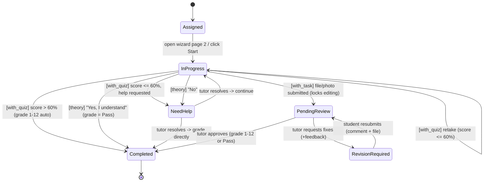

# Lesson Lifecycle

The `StudentLesson` status machine, grounded in `docs/core/lessons.md`. Six statuses, matching the doc's canonical numbered lifecycle exactly: `Assigned`, `InProgress`, `NeedHelp`, `PendingReview`, `RevisionRequired`, `Completed`.

## Lesson types

`Lesson.lesson_type` has exactly three values, each driving a distinct `InProgress` workflow (see `02-data-model.md`):

| `lesson_type` | Mechanism | Requires tutor review? |
|---|---|---|
| `with_quiz` | Multiple-choice quiz; auto-graded | Only via `NeedHelp` escalation on a low score |
| `theory` | Self-assessment ("Do you understand everything?") | Only via `NeedHelp` escalation on "No" |
| `with_task` | Student uploads a file/photo of completed work | Always — routes through `PendingReview` |

## State diagram

## Transition table

| from_status | to_status | trigger | actor | side effects |
|---|---|---|---|---|
| Assigned | InProgress | Open wizard page 2, or click "Start" | student | `started_at` stamped; `StudentLessonStatusEvent` row created |
| InProgress | Completed | `with_quiz`: score > 60% | system (auto) | `grade_points` set (1–12); `completed_at` stamped; `StudentLessonStatusEvent` created; `DiamondLedgerEntry` created |
| InProgress | InProgress | `with_quiz`: score ≤ 60%, student retakes | student | `attempt_count` incremented |
| InProgress | NeedHelp | `with_quiz`: score ≤ 60%, student requests help | student | `help_note` set; `StudentLessonStatusEvent` created |
| InProgress | Completed | `theory`: "Yes, I understand" | student | `grade_result = pass`; `completed_at` stamped; `StudentLessonStatusEvent` created; `DiamondLedgerEntry` created |
| InProgress | NeedHelp | `theory`: "No" | student | `help_note` set; `StudentLessonStatusEvent` created |
| InProgress | PendingReview | `with_task`: file/photo submitted | student | `LessonSubmission` row created (`is_latest=True`); edit-lock engaged; `StudentLessonStatusEvent` created |
| NeedHelp | InProgress | Tutor resolves, student continues | tutor | `tutor_feedback` set; `StudentLessonStatusEvent` created |
| NeedHelp | Completed | Tutor resolves, grades directly | tutor | `grade_points`/`grade_result` set; `completed_at` stamped; `tutor_feedback` set; `DiamondLedgerEntry` created |
| PendingReview | Completed | Tutor approves | tutor | `grade_points`/`grade_result` set; `completed_at` stamped; edit-lock released (moot — terminal); `DiamondLedgerEntry` created |
| PendingReview | RevisionRequired | Tutor requests fixes | tutor | `tutor_feedback` set; `StudentLessonStatusEvent` created; edit-lock released |
| RevisionRequired | PendingReview | Student resubmits | student | new `LessonSubmission` row created (`is_latest=True`, prior row's `is_latest=False`); edit-lock re-engaged |

## Grading

Recorded only once a `StudentLesson` transitions into `Completed`:
- **Points**: 1–12 scale (`grade_points`).
- **Binary**: Pass/Fail (`grade_result`), used by `theory` lessons and any lesson configured with `grading_type = binary`.

Which system applies is determined by `Lesson.grading_type`, set at the curriculum-authoring level, not per-submission.

## Edit-lock rule

While `status == pending_review`, the student cannot edit the lesson — enforced server-side (a permission/state check in `lessons.services`, not merely hidden in the UI). The lock releases only on a tutor decision (`Completed` or `RevisionRequired`).

## Clarifications from the updated `docs/core/lessons.md`

- **Quiz retake on score ≤ 60% stays within six statuses — no `Failed` status.** The doc's canonical numbered lifecycle (top of the file) lists exactly six statuses; a later, duplicated "Grading System" section says the quiz path "remains active (**or updates to Failed**)" on a low score — an inconsistent aside, not a new formal state in the canonical list. This design keeps the state machine at six statuses and treats a low quiz score as staying `InProgress` (retry via `attempt_count`), not introducing a `failed` status. The doc's inconsistency itself is flagged in `07-open-questions.md` rather than silently resolved.
- **Only `with_task` (manual submission) inherently requires tutor review.** `with_quiz` and `theory` lessons only ever reach a tutor via the `NeedHelp` escalation (low score + help request, or "No" to the understanding check) — they never route through `PendingReview`. `PendingReview` is `with_task`-only.
- **Comments are per-actor and per-context, not a single free-form thread.** The doc's "both tutor and student can write comment to the lesson" maps onto existing fields: `StudentLesson.help_note` (student, on help request), `StudentLesson.tutor_feedback` (tutor, on Need-Help resolution or Pending-Review decision), and `LessonSubmission.comment` (student, per submission/resubmission). No unified `Comment`/thread model is needed.

---
[← Back to Overview](00-overview.md)
