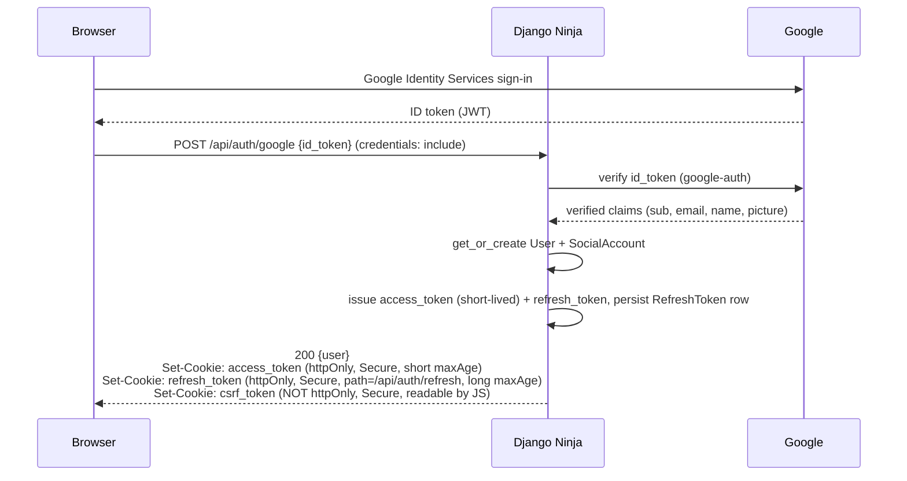
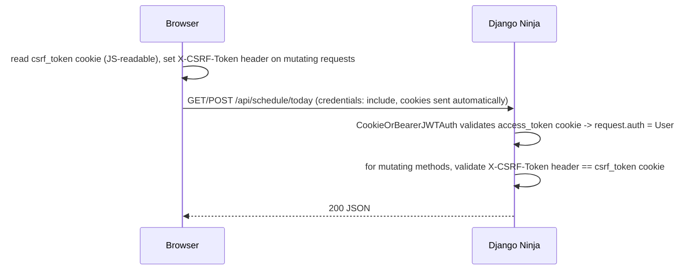
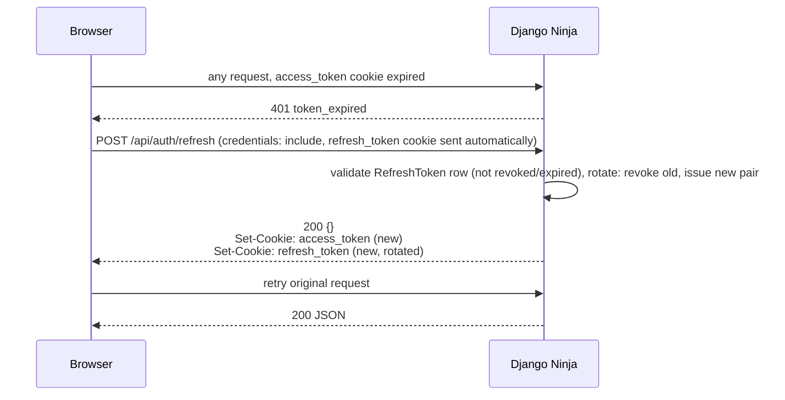
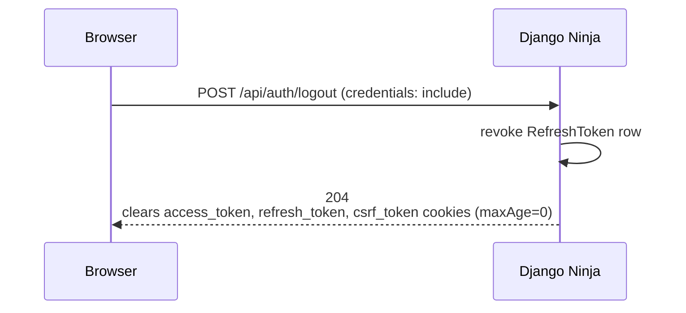
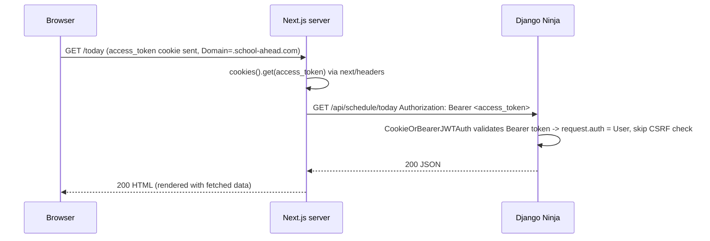

# Auth Flow

JWT-based auth with Google sign-in. The frontend calls Django **directly** — there is no Next.js BFF. Django itself sets and reads httpOnly auth cookies, so tokens still never reach client-side JavaScript even without a proxy layer. The **same** JWT authenticates two call paths: the browser calling Django via the Orval client's React Query hooks (cookie-authenticated), and Next.js's own server — Server Components, Route Handlers, Server Actions — calling the same Orval-generated client server-side (Bearer-authenticated, using the token read out of that same cookie). Django never issues Next.js a separate credential.

## Library choices

- **`django-ninja-jwt`** for access/refresh issuance and cookie-based validation on the Django side.
- **`google-auth`**'s `id_token.verify_oauth2_token` to verify a Google-issued ID token obtained client-side via Google Identity Services, rather than a full `django-allauth` server-redirect flow — the frontend obtains the ID token client-side and POSTs it once, directly to Django. `django-allauth` is noted as an alternative if a server-redirect OAuth flow is preferred later.
- **`django-cors-headers`** to allow the frontend's origin to call Django with credentials (see CORS & CSRF below).

## Cross-origin cookie design

Removing the BFF means the browser holds a cross-site (or cross-origin, depending on deployment topology) relationship with Django, so three things replace what the BFF used to do implicitly:

1. **CORS**: Django must allow the frontend's origin explicitly, with credentials — `CORS_ALLOWED_ORIGINS = [FRONTEND_ORIGIN]` and `CORS_ALLOW_CREDENTIALS = True`. The Orval-generated client's underlying fetch/axios call sets `credentials: 'include'` (fetch) / `withCredentials: true` (axios) on every request so the browser attaches and accepts the auth cookies cross-origin.
2. **Cookie `SameSite`**: recommend deploying the frontend and Django under the **same registrable/parent domain** (e.g. `app.school-ahead.com` and `api.school-ahead.com`) — per the `SameSite` spec, "site" is scheme + registrable domain (subdomain and port don't matter), so this keeps the request **same-site** and the cookies can use `SameSite=Lax` without needing `Secure`-only `SameSite=None`. If frontend and backend must live on genuinely different registrable domains, fall back to `SameSite=None; Secure`, which requires HTTPS everywhere (including local dev — see the callout below).
3. **CSRF**: cross-site/cross-origin cookie-authenticated APIs need explicit CSRF protection, since the browser attaches cookies automatically even to a request triggered by another site's script. Django's built-in CSRF middleware is designed around session auth; here we use the same **double-submit cookie** pattern it's built on, applied to the JWT cookies: Django issues a `csrf_token` cookie (readable by JS — **not** httpOnly) alongside the JWT cookies on login. The Orval client's custom mutator reads that cookie and attaches it as an `X-CSRF-Token` header on every mutating request (`POST`/`PATCH`/`DELETE`). A custom Ninja middleware/dependency validates the header matches the cookie for any request from a session-cookie-authenticated user, rejecting it otherwise. **This check only applies when the request authenticated via the cookie** — see below for why Bearer-authenticated requests are exempt.

## Server-side Orval calls from Next.js

The Orval-generated client is used from **two** places, each with its own mutator, both targeting the same Django API and the same user session:

- **Browser (Client Components)**: the mutator documented above — `credentials: 'include'`, plus the `X-CSRF-Token` header for mutations.
- **Next.js server (Server Components, Route Handlers, Server Actions)**: a separate server-side mutator reads the `access_token` cookie value directly off the incoming request via `next/headers`'s `cookies()`, and calls Django with `Authorization: Bearer <access_token>` instead of relying on cookie forwarding. This is the same access token the browser has — Next.js's server never requests or holds its own credential.

This requires two things beyond what a browser-only design needs:

1. **Django's auth class accepts either credential**: `CookieOrBearerJWTAuth` (renamed from the earlier `CookieJWTAuth` — see `04-api-design.md`) checks the `access_token` cookie first, then falls back to an `Authorization: Bearer` header. Both resolve to the same `request.auth = User`.
2. **The cookie's `Domain` attribute must be the shared parent domain** (e.g. `Domain=.school-ahead.com`), not host-only. A cookie Django sets while handling a request to `api.school-ahead.com` is, by default, only ever sent back to `api.school-ahead.com` — for the *browser* to also attach it when it requests a page from `app.school-ahead.com` (so Next.js's server can read it via `cookies()`), Django must set `Domain=.school-ahead.com` explicitly. This is stricter than the `SameSite=Lax` recommendation above, which only needed a shared *registrable* domain — reading the cookie server-side needs the cookie's `Domain` to actively span both subdomains.
3. **CSRF does not apply to the Bearer path.** The double-submit check exists because browsers auto-attach cookies to requests a malicious third-party page can trigger; a Bearer header is never auto-attached by a browser, so a request authenticated via `Authorization: Bearer` carries no CSRF risk by construction. `CookieOrBearerJWTAuth` records which credential resolved the request, and the CSRF dependency only runs when it was the cookie.

### Token refresh is unavailable inside a plain Server Component render

Next.js Server Components can **read** cookies via `cookies()` but — by framework design — cannot **write** them during a GET page render; only Route Handlers and Server Actions can call `cookies().set(...)`. That means if the `access_token` cookie is expired when a Server Component renders, it cannot run the refresh flow (Diagram C) and persist the new tokens back to the browser from there. The resolution:

- A Server Component with an expired/missing `access_token` simply skips that authenticated server-side fetch (renders an unauthenticated/loading shell for that section) rather than attempting a refresh.
- The client-side Orval mutator's `401` interceptor (Diagram C) then runs after hydration as normal and refreshes transparently — so a stale SSR render self-corrects on the client within one round trip, at the cost of a brief loading flash for data fetched server-side with an already-expired token.
- Route Handlers and Server Actions, which **can** set cookies, may run the full refresh flow themselves when appropriate (e.g. a Server Action that calls a mutating endpoint can refresh first, write the new cookies, then proceed).

## Diagram A — Google login

The response body sent to the browser never includes `access_token`/`refresh_token` — only cookies carry them, and only `csrf_token` is JS-readable.

## Diagram B — Authenticated request

## Diagram C — Refresh

The Orval client's Axios/fetch instance carries a response interceptor that catches a `401`, calls `/api/auth/refresh` once, and retries the original request — this replaces the BFF's transparent-refresh responsibility, now living in the frontend's API-client layer instead of a server-side proxy.

## Diagram D — Logout

## Diagram E — Next.js server call (Server Component / Route Handler / Server Action)

If `access_token` is missing or expired at step 2, the Server Component skips the fetch rather than refreshing (see "Token refresh is unavailable inside a plain Server Component render" above); a Route Handler or Server Action in the same position may refresh first.

## Cookie attributes

| Cookie | httpOnly | Secure | SameSite | Domain | Path | TTL | Notes |
|---|---|---|---|---|---|---|---|
| `access_token` | Yes | Yes | Lax (same parent domain) / None (cross-domain) | `.school-ahead.com` — shared parent, **not host-only** | `/` | 5–15 min | short-lived; sent on every request automatically; the shared `Domain` is what lets Next.js's server read it too (Diagram E) |
| `refresh_token` | Yes | Yes | Lax / None | `.school-ahead.com` | `/api/auth/refresh` | 30 days | scope-restricted path; rotated on every use with old-token revocation to detect reuse/theft |
| `csrf_token` | **No** | Yes | Lax / None | `.school-ahead.com` | `/` | matches access_token session | JS-readable by design — mirrored into the `X-CSRF-Token` header on mutating requests; not needed for the server-side Bearer path |

The explicit `Domain=.school-ahead.com` (rather than Django's default host-only cookie, scoped only to `api.school-ahead.com`) is what makes the browser attach `access_token` when it requests a page from `app.school-ahead.com` too — without it, Next.js's server would never see the cookie and Diagram E wouldn't work.

## Token claims

| Claim | Source |
|---|---|
| `sub` | `User.id` |
| `role` | `User.role` |
| `email` | `User.email` |
| `jti` | `RefreshToken.id` (refresh token only) |
| `exp` / `iat` | standard JWT claims |

## Local development callout

Deploying frontend and backend under the same parent domain (recommended above) makes local dev simple too: `http://localhost:3000` and `http://localhost:8000` share the same registrable domain (`localhost`) per the `SameSite` spec — subdomain/port don't matter — so they're treated as same-site, and `SameSite=Lax` cookies flow normally over plain HTTP without needing `Secure`/HTTPS. The `Domain` attribute is likewise port-independent: a cookie set with `Domain=localhost` from Django on `:8000` is still visible to Next.js's server reading it via `cookies()` when the browser hits `:3000`, so the server-side call path (Diagram E) works locally without any extra setup — no local subdomains needed. If the production topology instead requires `SameSite=None; Secure` (genuinely different registrable domains), local development needs HTTPS too (e.g. via `mkcert` or a local reverse proxy) — flagged as a setup detail to resolve when this is implemented, not solved here since docker/CI/deployment topology is out of scope for this pass (see `07-open-questions.md`).

---
[← Back to Overview](00-overview.md)
