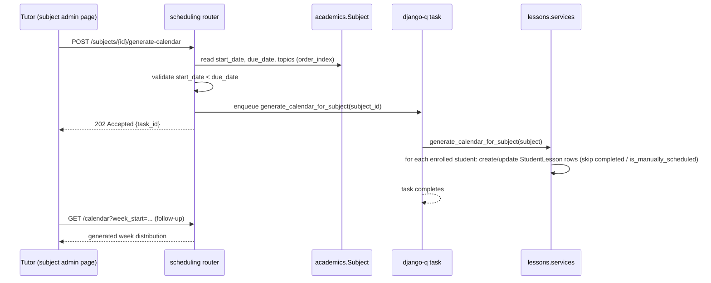

# Calendar Generation

Source: `docs/core/schedule_planning.md`. This covers how `Subject.start_date`/`due_date`, tutor-controlled `Topic` ordering, and a manually-triggered generation process combine to populate each student's `StudentLesson.scheduled_date`.

## Subject scheduling fields

- **`start_date`**: defaults to September 1 of the class's academic year; tutor/admin editable at any time via the subject details admin page.
- **`due_date`**: defaults to `start_date` + 9 months; tutors have full flexibility to set it to any date, with no rigid restrictions.
- **Guardrail**: `start_date` must always be strictly earlier than `due_date`, enforced on every write (see `02-data-model.md`).

## Topic ordering

`Topic.order_index` is tutor-editable (drag-and-drop or priority indices in the UI), exposed via a bulk-reorder endpoint. The current order is what generation reads at trigger time — there is no separate "planned order" vs. "applied order"; the live `order_index` is always authoritative for the next generation/recalculation run.

## Generation is manual, never automatic

Nothing runs on a schedule or on save. Generation only runs when a tutor/admin clicks "Generate calendar" (or "Recalculate") on the subject admin page, which calls `POST /api/schedule/subjects/{id}/generate-calendar` — owned by the `scheduling` app, not `academics`. `scheduling` is a write-capable bounded context here, not just a read model (see `01-backend-apps.md`).

## Algorithm

Runs as a `lessons.services` function, invoked from a `django-q` task enqueued by the `scheduling` router (`02-data-model.md`, decision 6):

1. For the given `Subject`, take its `Topic`s in current `order_index` order.
2. Flatten to their `Lesson`s, each Topic's Lessons in their own `order_index` order.
3. Distribute the flattened Lesson sequence evenly across the week-range `[start_date, due_date]`.
4. For every `Student` enrolled in the subject's `Class`, create-or-update a `StudentLesson` per `Lesson` with the computed `scheduled_date`.
5. **Skip** any existing `StudentLesson` that is `status == completed` or `is_manually_scheduled == True` (`02-data-model.md`, decision 5) — completed history and deliberate tutor overrides are never silently overwritten.

## Manual single-lesson reschedule

`POST /api/schedule/student-lessons/{id}/reschedule {scheduled_date}` (tutor/admin only, owned by `scheduling`) calls into `lessons.services` to set `scheduled_date` directly and flag `is_manually_scheduled = True`, taking that lesson out of scope for future recalculation runs.

## Forced recalculation

Same algorithm as generation, re-triggered after `start_date`/`due_date`/topic-order changes, via `POST /api/schedule/subjects/{id}/recalculate-calendar`. Same skip rules apply (step 5 above).

## Trigger flow

## Design decisions beyond the literal doc text

- `is_manually_scheduled` and the completed/manually-scheduled skip rule are this design's answer to a question the source doc leaves open — see `07-open-questions.md` for the "Recalculation vs. manual overrides" caveat.
- Running generation as a background `django-q` task (rather than inline) is a scalability decision: it potentially touches `topics_in_subject × lessons_per_topic × students_in_class` rows.

---
[← Back to Overview](00-overview.md)
